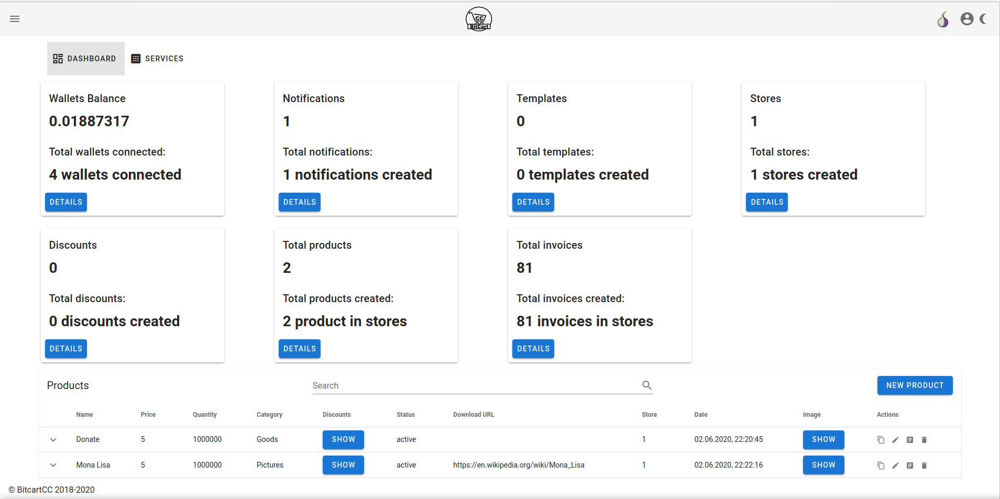

# Bitcart Admin Panel

This is the Bitcart Admin Panel.

It is created to simplify usage of Bitcart Merchants API,
making adding or editing data easy, plus containing a checkout page which can be used by various integrations.

The admin panel always covers 100% of the Merchants API.

[Live demo](https://admin.bitcart.ai)

## Contributing

See [CONTRIBUTING.md](CONTRIBUTING.md).
